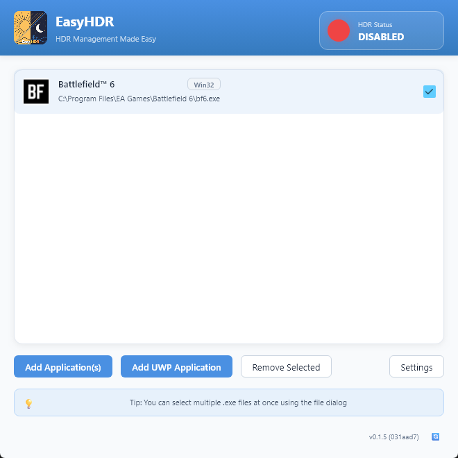
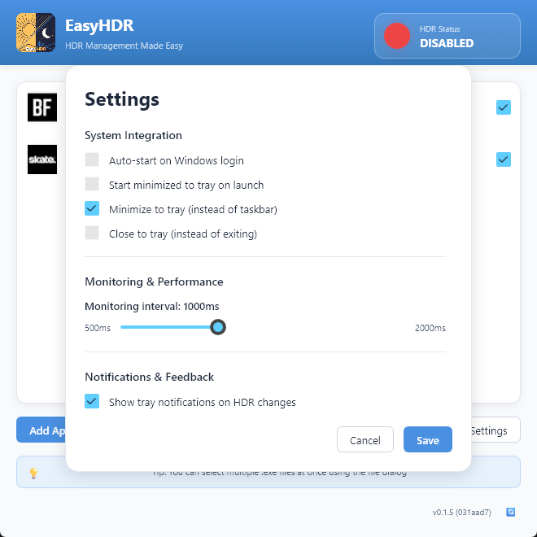
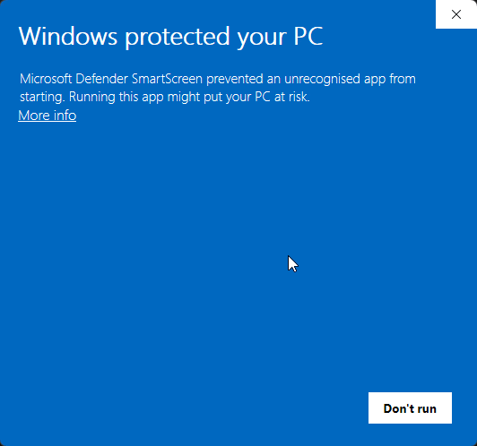
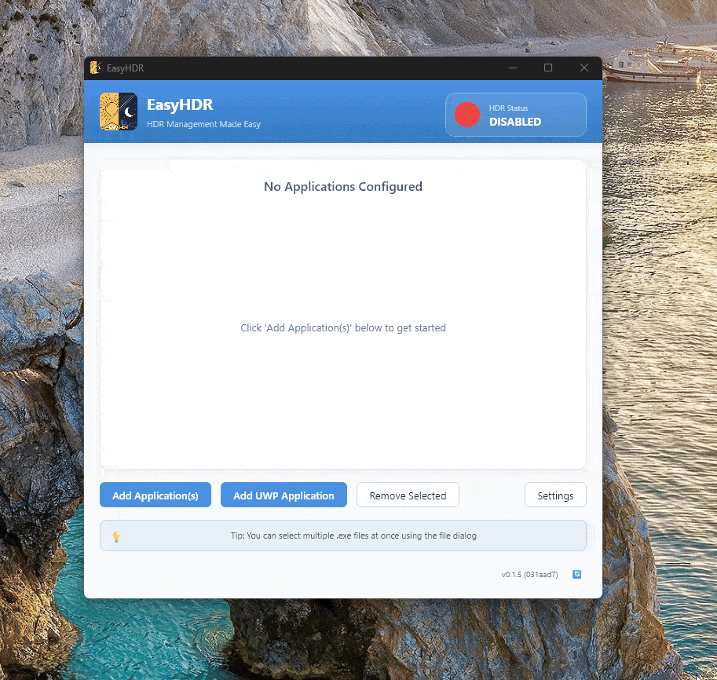

# EasyHDR

<p align="center">
  
</p>

<p align="center">
  <a href="https://github.com/engels74/EasyHDR/releases"></a>
  <a href="https://github.com/engels74/EasyHDR/blob/main/LICENSE"></a>
  <a href="https://github.com/engels74/EasyHDR/stargazers"></a>
  <a href="https://deepwiki.com/engels74/EasyHDR"></a>
</p>

A lightweight Windows utility that automatically enables HDR when you launch configured applications and disables it when you close them.

## Preview

<p align="center">
  <a href="assets/readme/png/05-application-added.png">
    
  </a>
  <a href="assets/readme/png/06-settings-window.png">
    
  </a>
</p>

<p align="center">
  <em>Click any preview to view full size</em>
</p>

## How It Works

EasyHDR monitors running processes at regular intervals (500-1000ms). When a configured application starts, HDR is enabled globally across all capable displays within 1-2 seconds. When the last monitored application closes, HDR is automatically disabled. A 500ms debounce delay prevents rapid toggling if applications restart quickly.

The application uses Windows Display Configuration APIs to control HDR state, with version-specific implementations for Windows 10, Windows 11, and Windows 11 24H2+.

## Installation

**Requirements:**
- Windows 10: 21H2 (Build 19044) or later
- Windows 11: 21H2 (Build 22000) or later
- HDR-capable display

**Steps:**
1. Download the latest release from the [Releases](https://github.com/engels74/EasyHDR/releases) page
2. Extract `easyhdr.exe` to a folder of your choice
3. Run `easyhdr.exe`
4. On first launch, Windows Defender SmartScreen will appear - click "More info" then "Run anyway"
5. Click "Add Application" and select the `.exe` files you want to monitor
6. Minimize to system tray

Configuration is stored at `%APPDATA%\EasyHDR\config.json` and saved automatically.

## First Time Setup

<p align="center">
  <a href="assets/readme/gif/01-launch-app.gif">
    
  </a>
  <a href="assets/readme/gif/02-add-application.gif">
    
  </a>
</p>

<p align="center">
  <em>Click any preview to view full size</em>
</p>

<p align="center">
  <sub><strong>Launch:</strong> Bypassing SmartScreen warning (unsigned app)</sub><br>
  <sub><strong>Add Application:</strong> Adding applications to monitor</sub>
</p>

## Dependencies

**Core:**
- `slint` - GUI framework
- `windows` - Windows API bindings
- `serde` / `serde_json` - Configuration serialization
- `tracing` / `tracing-subscriber` - Logging
- `parking_lot` - Synchronization primitives

**Windows Integration:**
- `winreg` - Registry access for auto-start
- `tray-icon` - System tray integration
- `rfd` - Native file dialogs
- `tauri-winrt-notification` - Toast notifications
- `reqwest` - Update checking

## Development

### Performance Benchmarking

Baseline performance metrics (measured with Criterion on release builds):

- **Config Serialization**: ~20 µs
- **Config Deserialization**: ~35 µs
- **Config Round Trip**: ~55 µs
- **HDR State Detection**: Platform-dependent (Windows only)

Run benchmarks: `cargo bench`

To detect performance regressions, compare new benchmark results against these baselines. Criterion automatically tracks changes between runs and flags statistically significant regressions (>5% slower).

### Fuzzing

Three fuzz targets are available to test robustness:

1. **`fuzz_config_json`** - Tests configuration JSON parsing for crashes/panics
2. **`fuzz_process_name`** - Tests process name extraction from arbitrary paths
3. **`fuzz_windows_api`** - Tests Windows API structures and bit field logic

**Running fuzzing targets:**

```bash
# Install cargo-fuzz (requires nightly)
cargo install cargo-fuzz

# Run a specific fuzz target for 60 seconds
cargo +nightly fuzz run fuzz_config_json -- -max_total_time=60

# Run all targets sequentially
cargo +nightly fuzz run fuzz_config_json -- -max_total_time=60
cargo +nightly fuzz run fuzz_process_name -- -max_total_time=60
cargo +nightly fuzz run fuzz_windows_api -- -max_total_time=60
```

## License

This project is licensed under the GNU Affero General Public License v3.0 (AGPL-3.0). See [LICENSE](LICENSE) for details.

